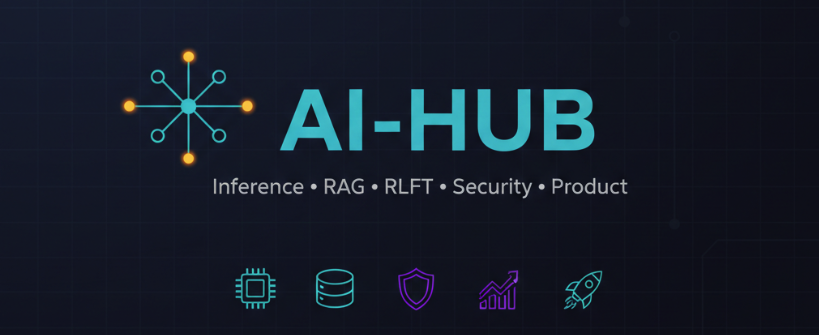

# AI Hub

**A practical, end-to-end learning and building hub for modern AI systems**




> From LLM builder patterns to agentic systems, reasoning models, security, and EvalOps — all in one place.

---

## Why AI Hub exists

Most AI learning resources are fragmented, tool-specific, overly academic, or disconnected from what actually ships. AI Hub is a curated, evolving knowledge base focused on how real AI systems are designed, built, deployed, secured, and improved — especially in production and enterprise contexts.

Think of it as:
- 📚 a learning hub
- 🧠 a mental model library
- 🧪 a workshop + lab companion
- 🛠️ a builder’s reference

---

## What you’ll learn here

### Core areas

- **LLM Builder Patterns**: what works in production, anti-patterns, failure modes
- **AI Coding**: best practices for AI-assisted development
- **Context Engineering**: RAG, Hybrid RAG, GraphRAG, memory, grounding, retrieval trade-offs
- **Inference Engineering**: latency, cost, batching, model selection
- **Small Language Models (SLMs)**: build and deploy compact models
- **Reasoning Models**: structured reasoning, verification, tool-augmented thinking
- **Alternative Architectures**: diffusion models and state space models (SSMs)
- **Agents & Orchestration**: tool use, memory, A2A topologies
- **Security & Governance**: network, data, model, safety by default
- **EvalOps & CostOps**: measure → iterate → win
- **AI Startups**: curated startup landscape

---

## Repository structure

```text
ai-hub/
├── ai-coding/                      # AI-assisted coding best practices
├── ai-for-science/                 # AI for science (biomed, proteins, etc.)
├── ai-product-strategy/            # Product thinking for AI systems
├── ai-security-and-governance/     # Security, risk, compliance
├── ai-startups/                    # Curated AI startup landscape
├── evalops/                        # Evaluation design + EvalOps notes
├── Graph-ML/                       # Graph ML (GraphML) & GNNs
├── inference-engineering/          # Latency, cost, performance
├── model-apis/                     # Provider APIs (Responses, tool calling, caching)
├── reinforcement-learning/         # RLFT, DPO, PPO, GRPO
├── retrieval-augmented-systems/    # RAG, Hybrid, GraphRAG
├── causal-ml/                      # Causal inference & causal ML
├── model-space/                    # Model families + alternative architectures
│   ├── diffusion-models/           # Diffusion models (incl. text/sequence research)
│   ├── reasoning-models/           # Reasoning LLMs & techniques
│   ├── small-language-models/      # SLMs: small LMs, training notes
│   ├── state-space-models/         # SSMs as alternative sequence architectures
│   ├── multi-modal-models/         # Multimodal models (text+vision+audio+video)
│   └── world-models/               # World models for planning/control
├── workshops/                      # End-to-end guided workshops
├── conference-notes-microsoft-ignite-2025/
├── assets/                         # Diagrams, visuals, figures
```

Each folder is self-contained, continuously evolving, and designed to be readable, forkable, and remixable.

---

## Azure AI Enablement Workshops

This repo also powers a 9-step end-to-end workshop series:

| Step | Focus | Outcome | Resources |
| ---: | --- | --- | --- |
| 1 | LLM Builder Patterns | Systems that actually ship | [Workshop notes](workshops/01-llm-builder-patterns-that-actually-ship/README.md) |
| 2 | Context Engineering | Reliable grounding & retrieval | [Workshop notes](workshops/02-context-engineering-on-azure-rag-hybrid-graphrag/README.md) |
| 3 | Agents | Tools, memory, orchestration | [Workshop notes](workshops/03-agents-on-azure-ai-foundry-tools-memory-orchestration/README.md) |
| 4 | MCP | Model Context Protocol in practice | [Workshop notes](workshops/04-mcp-on-azure-ai-foundry/README.md) |
| 5 | A2A | Multi-agent coordination | [Workshop notes](workshops/05-agent-to-agent-topologies-and-negotiation-on-azure/README.md) |
| 6 | Interfaces | Web, voice, realtime | [Workshop notes](workshops/06-conversational-interfaces-web-voice-realtime/README.md) |
| 7 | Product & Design | AI design thinking | [Workshop notes](workshops/07-product-and-design-ai-design-thinking-hax-patterns/README.md) |
| 8 | Security | Governed by default | [Workshop notes](workshops/08-secure-and-governed-by-default/README.md) |
| 9 | EvalOps & CostOps | Measure & optimize | [Workshop notes](workshops/09-evalops-and-costops-measure-iterate-win/README.md) |

Each workshop includes clear mental models, practical examples, and implementation guidance.

---

## Who this is for

Built for AI engineers, solution architects, product engineers, founders, and technical PMs who want real systems, not toy demos.

---

## How to use this repo

1. Pick a capability (e.g., `retrieval-augmented-systems`).
2. Read the conceptual notes.
3. Follow linked examples or workshops.
4. Fork and adapt to your own use case.
5. Revisit as new material lands.

---

## Status & roadmap

- 🟢 Actively maintained
- 🧩 New modules added incrementally
- 🧠 Deeper inference & agent content coming
- 📈 Eval & benchmarking material expanding

Star ⭐️ to track progress.

---

## Philosophy

> AI systems are engineered, not prompted.

This repo prioritizes systems thinking, clarity over cleverness, and production reality over demos.

---

## License

MIT — use it, remix it, build with it.
