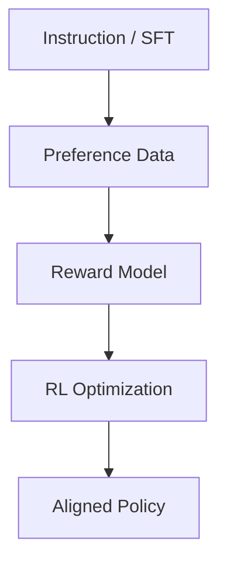

# The RLHF Book (MEAP v1) — Key Points

Source: `/Users/ozgurguler/Downloads/The_RLHF_Book_v1_MEAP.pdf`

<details>
<summary><strong>Quick navigation</strong></summary>

- [High-level takeaways](#high-level-takeaways)
- [Canonical RLHF pipeline](#canonical-rlhf-pipeline)
- [Post-training taxonomy](#post-training-taxonomy-book-framing)
- [Key chapters and themes](#key-chapters-and-themes)
- [Practical checklist](#practical-checklist-for-your-repo-experiments)
- [Suggested artifacts](#suggested-artifacts-to-add-here)
</details>

## High-level takeaways

- RLHF is primarily a **post-training** technique that aligns model behavior to human preferences and style, not just next-token accuracy.
- Modern post-training is framed as three buckets: **Instruction/Supervised Finetuning (IFT/SFT)**, **Preference Finetuning (PreFT)**, and **Reinforcement Finetuning (RFT)**.
- RLHF is powerful but **costly** (data + compute) and **fragile** (reward hacking, length bias, over-optimization).
- The pipeline emphasizes **response-level** optimization, often via **contrastive learning** on preference data.
- The field is quickly evolving toward **direct alignment** (e.g., DPO-style) and **AI feedback** (constitutional/synthetic).

## Canonical RLHF pipeline



- **Step 1: SFT/IFT** makes the model follow instructions and formatting conventions.
- **Step 2: Preference data** (pairwise rankings, comparisons, rubric scoring) captures human judgments.
- **Step 3: Reward modeling** turns preferences into a learned scalar signal.
- **Step 4: RL optimization** improves response-level behavior under regularization.

## Post-training taxonomy (book framing)

```text
IFT/SFT  -> format and instruction following
PreFT    -> human preferences and style alignment (RLHF core)
RFT      -> reinforcement finetuning for verifiable tasks
```

## Key chapters and themes

### Definitions & setup
- Grounding in RL, LLMs, and formal objective setup is required to reason about alignment trade-offs.
- Preferences are **not direct labels**; they are **comparative** judgments and often noisy.

### Preference data
- Quality and consistency of feedback are essential; preference collection is a major bottleneck.
- Pairwise comparisons are the common format; data can be human, AI-assisted, or synthetic.

### Reward modeling
- Reward models are learned proxies for human judgment and are prone to **distribution shift**.
- Reward models can be used not only for RL but also for **data filtering** or **re-ranking**.

### Regularization
- Regularization (e.g., KL penalties, constraints) is critical to avoid drifting away from the base model.
- Over-optimization and reward hacking are recurring failure modes.

### Optimization methods
- **Rejection sampling** is a simple baseline: generate, score, keep the best.
- **Policy gradients** (PPO-style) are a core RLHF method for preference optimization.
- **Direct alignment** methods optimize from preferences without an explicit reward model (e.g., DPO-style).

### Advanced topics
- **Constitutional AI / AI feedback**: uses critique/feedback from other models to scale alignment.
- **Reasoning & inference-time scaling**: more RL-like techniques targeted at verifiable tasks.
- **Tool use / function calling**: training models to select tools, reflect structured outputs.
- **Synthetic data & distillation**: shift from expensive human data toward model-generated data.

### Open questions
- **Over-optimization** is inevitable with soft reward signals; needs guardrails.
- **Style vs. information**: RLHF’s largest gains may be user experience and presentation.
- **Product/UX alignment**: RLHF increasingly shapes model “character” for product fit.

## Practical checklist (for your repo experiments)

- Define **preference rubrics** upfront (style, safety, accuracy, concision).
- Decide **data sources**: human ratings, synthetic, or AI feedback.
- Train a **reward model** and validate against held-out preference sets.
- Use **regularization** (KL targets, reward clipping) in RL stages.
- Compare **DPO vs PPO** vs **rejection sampling** to determine trade-offs.
- Track **length bias** and **reward hacking** with targeted evals.

## Suggested artifacts to add here

- Preference dataset schema and annotation guide.
- Reward model training notebook.
- RL training config with safety and KL targets.
- Evaluation suite for style, safety, and factuality.
