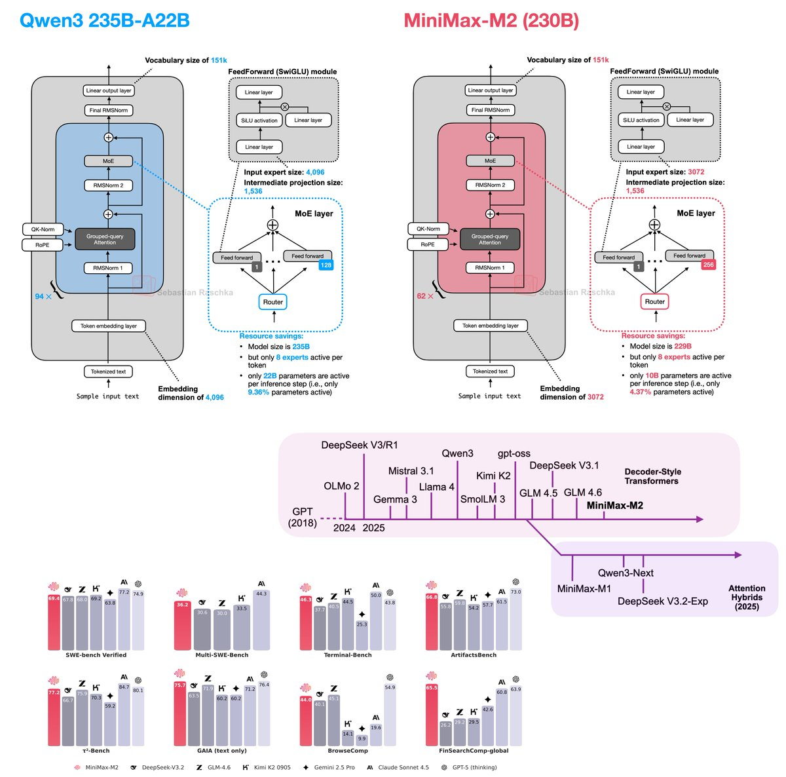

# MiniMax-M2 (minimax2)

MiniMax-M2 is a **MiniMax** (Chinese AI lab) model that’s often discussed as a strong **open(-weight) reasoning + coding** model with an emphasis on **efficiency** (lower latency and cost vs. frontier closed APIs).

This note is intentionally **spec-light**: add primary sources (model card, paper, repo) and verified numbers as you collect them.

## At a glance (why people care)

- **Practical coding + agent workflows**: often described as strong on real-world developer tasks (refactors, bug fixes, test generation) and agent loops (tool use).
- **Efficiency**: frequently reported as MoE with ~**10B active** parameters (and much larger total), aiming for lower latency/cost.
- **Deployability**: positioned for self-hosted / on-prem scenarios and also offered via a hosted API.

## Source-backed notes (claims to validate)

### From Simon Willison’s writeup

- **Released** 2025-10-27 by MiniMax (Chinese AI lab founded 2021).
- **Benchmark positioning (reported)**: comparable to “Sonnet-class” models on some self-reported scores; ranked highly among open-weights models by third parties (per the cited excerpt).
- **Efficiency profile (reported)**: ~**10B active parameters** with ~**200B total** (MoE-style), and ~**230GB** weights on Hugging Face.
- **Agentic strengths (reported)**: strong **tool use** and **instruction following** (mentions Tau2 Bench and IFBench).
- **Tradeoff hypothesis (reported)**: strong for agent workflows, but may underperform larger open-weights generalists (e.g., DeepSeek V3.2, Qwen3 235B) on some broad tasks.
- **Local run feasibility (reported)**: small enough to run on a **256GB Mac Studio**, with **MLX** community support.

Treat these as **claims to validate** with primary sources (model card/tech report) and your own eval harness.

## Architecture notes (high-impact integration points)

These items are useful because they connect “benchmarks are good” to **specific knobs** that affect latency, memory, and reliability. Some are based on third-party analysis; confirm against the model config and code once you have primary sources.



### Full attention (vs “efficient attention” variants)

- Reported as using **full attention** modules (decoder-style Transformer) rather than an “efficient/lightning attention” variant used by MiniMax-M1.
- Why it matters: full attention can improve modeling quality and benchmark performance, but can be more expensive at long context.

### Per-layer QK-Norm (per-head variant)

Key concept: **QK-Norm**  
Normalizing queries/keys helps stabilize attention (especially at scale/long context) and can improve training/inference stability.

- Reported nuance: a “per-layer” QK-Norm where the norm is not only per block, but also **unique per attention head** (instead of shared across heads).
- Why it matters: per-head normalization can reduce head-to-head interference, improving stability/quality at modest additional compute/params.

### Sliding-window attention (present, disabled by default)

- Reported as having a **sliding-window attention** configuration (similar to Gemma/Mistral families), but **disabled by default**.
- Why it matters: if enabled, sliding windows trade global context quality for better long-context efficiency.

### MoE sparsity (active compute ratio) and shared experts

Key concept: **active vs total parameters (MoE)**  
In Mixture-of-Experts (MoE) models, total parameters can be large, but only a small fraction activates per token. This “active compute ratio” is a major driver of latency/cost.

- Reported detail: M2 does **not** use a shared expert (similar to Qwen3, unlike some variants such as “Next” families).
- Reported comparison: at similar total size to Qwen3 235B-A22B, M2 is ~**twice as sparse** (e.g., **10B active** vs **22B active** per token; ~**4.37%** active vs ~**9.36%**).
- Why it matters: more sparsity can mean lower cost/latency, but can trade off quality if expert capacity/routing isn’t tuned well.

## Agent readiness (concepts that matter in practice)

Key concept: **tool use**  
Reliably decides *when* to call tools and produces schema-correct tool inputs/outputs.

Key concept: **instruction following**  
Follows constraints (format, policies, multi-step rubrics) without drifting—critical for agents that must be predictable.

Key concept: **interleaved thinking / reasoning traces**  
Some “agentic thinking” models emit separate “thinking”/trace content. If the API expects those traces to be included in conversation history, your client must preserve them between turns.

## Deployment + API notes

Key concept: **open weights vs hosted API**  
“Open weights” usually means you can download and run the model weights yourself (licensing still matters). Separately, a hosted API is a time-to-value tradeoff.

Key concept: **Anthropic-compatible endpoints**  
Clients speak an Anthropic-style schema but point at a different provider `base_url`, enabling reuse of SDKs and middleware.

Practical guidance:
- Preserve the provider’s expected message format across turns (don’t drop “thinking” blocks if the API requires them).
- Avoid logging or exposing reasoning traces in production unless you have a clear privacy/security posture.

Reported pricing in the cited writeup:
- Free until **2025-11-07**, then **$0.30 / 1M input tokens** and **$1.20 / 1M output tokens** (time-bound; verify current pricing).

## Ecosystem notes (developer tooling)

The cited source highlights a small community integration via Simon Willison’s `llm` CLI:

```bash
llm install llm-minimax
llm keys set minimax
llm -m m2 -o max_tokens 10000 "Generate an SVG of a pelican riding a bicycle"
```

## Compare & contrast (keep it testable)

- **MiniMax-M2 vs Qwen3 (architecture)**: reported as extremely similar overall, with a standout difference in per-head QK-Norm and higher MoE sparsity; validate via config/code.
- **MiniMax-M2 vs DeepSeek-V3.2 (positioning)**: M2 often framed as efficient “agentic/coding” workhorse; V3.2 often treated as a stronger general base model in a broader stack.
- **MiniMax-M2 vs Kimi-K2 (usage)**: M2 tends to be framed around efficiency + code/agent loops; Kimi tends to be framed around long-context reading/synthesis.

## What to verify / fill in (pending primary sources)

- License and “open” status (weights availability, commercial terms)
- Architecture (dense vs MoE; active parameters; context length)
- Training mix (code/math weighting, multilingual balance)
- Tool/function-calling support and structured outputs behavior
- Benchmark + “real repo task” eval details (datasets, harness, scoring methodology)
- Architecture details called out above (full attention choice, QK-Norm variant, sliding-window flag, shared experts, active compute ratio).

## References (TODO)

- Simon Willison, “MiniMax M2 & Agent: Ingenious in Simplicity” (2025-10-29): https://simonwillison.net/2025/Oct/29/minimax-m2/
- “The Big LLM Architecture Comparison” (MiniMax-M2 entry; link TBD)
- Official model card / repo:
- Technical report:
- Independent evals (share methodology, not just scores):
