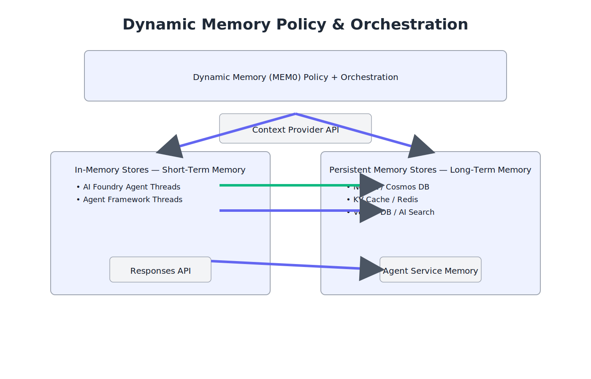
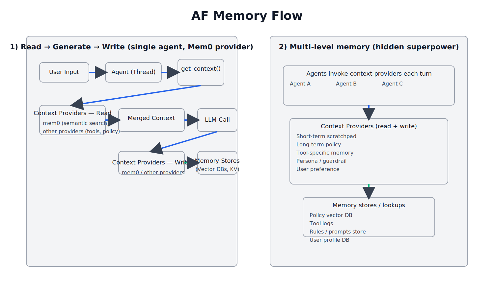
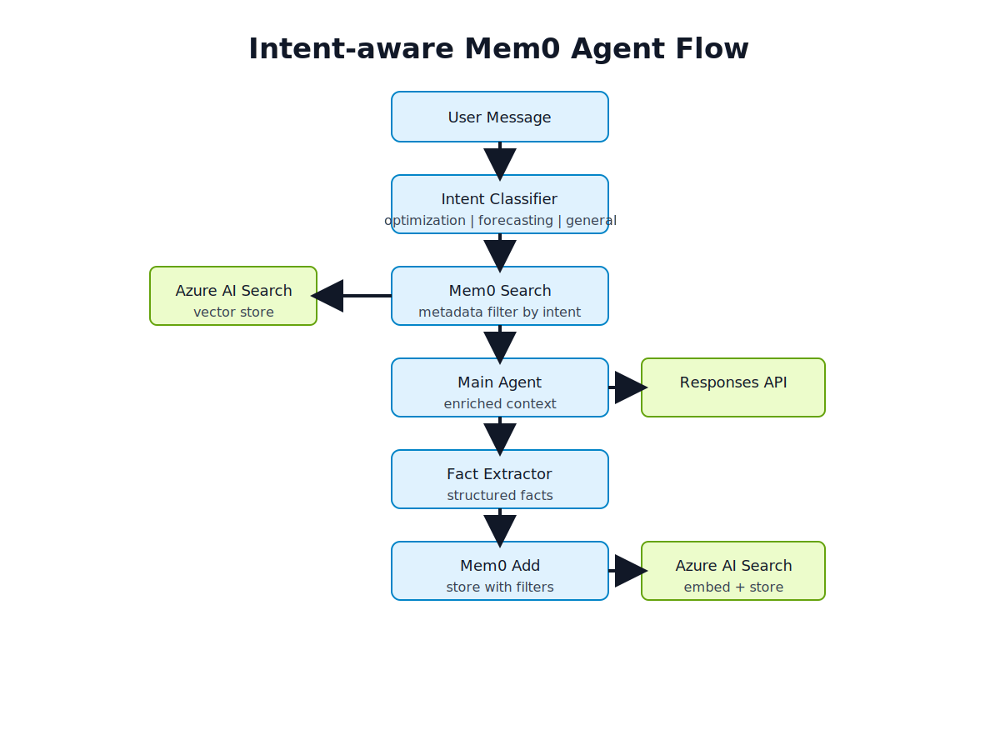
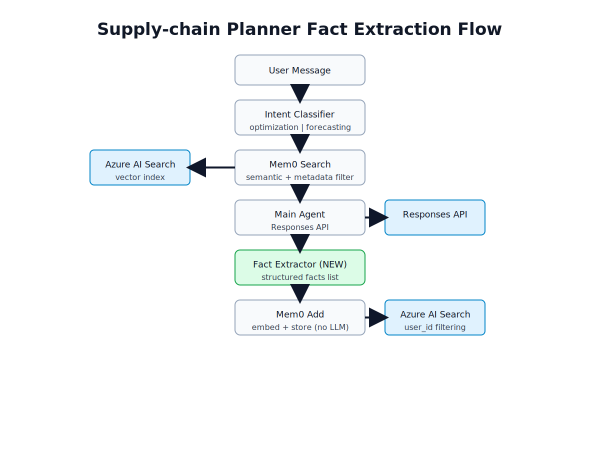

# 🤖 AI Agents Learning Hub

<p align="center">
  
</p>

> A polished, workshop-ready fork of Microsoft’s Agent Framework with runnable samples for agents, workflows, memory, reasoning, and Azure AI Foundry. This is also the prototyping ground for new features and Microsoft Innovation Hub experiments before they land upstream.


---

## Why This Repo
- **🚀 Ship faster:** Small, runnable samples with the exact env vars you need.
- **🔗 Stay aligned:** Mirrors [microsoft/agent-framework](https://github.com/microsoft/agent-framework) patterns, trimmed for workshops.
- **🧠 Cover the surface:** Agents, workflows, memory patterns, reasoning, and Azure AI Foundry agents.
- **🧪 Prototype hub:** Most new feature spikes start here, including Microsoft Innovation Hub–driven experiments, before flowing back upstream.

---

## Quick Start
```bash
cd projects/agents

python -m venv .venv
source .venv/bin/activate            # Windows: .venv\Scripts\activate
pip install -U pip
pip install -r requirements.txt
```
Optional: Node 18+ + yarn/npm for the frontend portal.

### Core Environment (Azure OpenAI / Responses)
```bash
AZURE_OPENAI_ENDPOINT=https://<resource>.openai.azure.com/
AZURE_OPENAI_API_KEY=...
AZURE_OPENAI_API_VERSION=2024-12-01-preview
AZURE_OPENAI_DEPLOYMENT_NAME=gpt-4o-mini
```

### Azure AI Foundry (Agents API)
```bash
AZURE_AI_PROJECT_ENDPOINT=https://<project>.services.ai.azure.com/
AZURE_AI_MODEL_DEPLOYMENT_NAME=gpt-4.1
# Auth: az login (DefaultAzureCredential) or project key via AZURE_AI_PROJECT_KEY
```

OPENAI_API_KEY is honored as a fallback in some samples, but Azure settings are the default path.

---

## Pathfinding Guide (What to run)
- **Agents quickstart:** `python 01-af-getting-started-agents/00-first-agent.py "Write a haiku"`
- **Streaming / vision / tools:** see `01-af-getting-started-agents/` (streaming, vision, single/multi tool calls, structured outputs, observability, persistence).
- **Workflows:**  
  - Concurrent: `python 02-af-getting-started-workflows/orchestrations/01-concurrent/concurrent_workflow_sample.py`  
  - Group chat: `python 02-af-getting-started-workflows/orchestrations/02-group-chat/group_chat_sample.py`  
  - Handoff: `python 02-af-getting-started-workflows/orchestrations/03-handoff/handoff_sample.py`  
  - Magentic: `python 02-af-getting-started-workflows/orchestrations/04-magentic/magentic_sample.py`  
  - Sequential: `python 02-af-getting-started-workflows/orchestrations/05-sequential/sequential_sample.py`
- **Workflow extras:** `python 02-af-getting-started-workflows/other_patterns/checkpoints/sample.py` (swap `checkpoints` for `shared-states`, `workflows-as-agents`, `observability`).
- **Memory (short-term):** `python 05-agent-memory-general/11_agent_framework_in_memory_short_term_chat.py`.
- **Memory (stores):** `python 05-agent-memory-general/12_agent_framework_ai_search_chat_message_store.py` (AI Search), `.../12_agent_framework_custom_chat_message_store.py` (JSON), `.../12_agent_framework_builtin_chat_message_store_chat_client.py` (built-in store), `.../12_agent_framework_redis_chat_message_store_chat_client.py` (Redis).
- **Memory (long-term + Mem0):** `python 05-agent-memory-general/15_agent_framework_long_term_mem0_cross_threads.py` or `.../15_agent_framework_long_term_mem0provider_basic_chat_client.py`; multi-agent sharing via `16_*`.
- **Intent-aware memory + fact extraction:** `python 05-agent-memory-general/22_intent_aware_mem0_agent.py` (scripted demo in `22_demo_script.txt`).
- **Thread serialization:** `python 05-agent-memory-general/17_agent_framework_thread_serialization_and_persistence.py` (save a thread, restart, and keep chatting with full context).
- **Advanced reasoning:** `python 03-af-advanced-reasoning-use-cases/00-first-agent-reasoning.py` (Responses + reasoning_effort) or `temporal-reasoning-*.py`.
- **Azure AI Foundry agents:** `python 04-foundry-agent-service/base_agent_framework_foundry_agent.py "Give me a tip for Foundry"` (requires `az login` + project endpoint).
- **Frontend portal (optional):**
  ```bash
  cd 03-af-advanced-reasoning-use-cases/reasoning-demos-portal
  yarn install
  yarn dev
  ```

---

## Memory Patterns (05-agent-memory-general)
- **Short-term options:** DIY stateless history (`01_stateless_history.py`, `02_responses_api_stateless_manual_history.py`, `10_agent_framework_baseline_no_memory.py`) vs. thread-backed chat (`11_agent_framework_in_memory_short_term_chat.py`).
- **Pluggable stores:** `12_*` variants swap chat history into Azure AI Search, built-in `ChatMessageStore`, custom JSON, or Redis so threads survive process restarts.
- **Long-term Mem0 + vector search:** `15_*` samples store/retrieve user facts across threads (Mem0 + Azure AI Search embeddings); `16_*` shares that long-term memory across multiple agents.
- **Thread lifecycle:** `14_agent_framework_responses_persist_and_resume_thread.py` and `17_agent_framework_thread_serialization_and_persistence.py` serialize/restore threads with full context.
- **Planner demos:** `20_agent_framework_mem0_memory policy.py` and `21_chat_ui_mem0_agent.py` show a supply-chain planner copilot that recalls episodic incidents; `22_intent_aware_mem0_agent.py` adds intent-aware metadata filters (optimization vs forecasting) driven by `22_demo_script.txt`.

<p align="center">
  
</p>

<p align="center">
  
</p>

### Intent-aware long-term memory (`22_intent_aware_mem0_agent.py`)
- Pipeline: classify user intent (optimization vs forecasting), filter Mem0 search by metadata tags, route the enriched context to the main agent, then extract new facts to append back into long-term memory.
- Mem0 search uses Azure AI Search under the hood; metadata filters keep threads focused on the right slice of history.
<p align="center">
  
</p>

### Supply-chain planner fact-extraction flow (`22_demo_script.txt`)
- End-to-end path: user message → intent classifier → Mem0 semantic search (filtered by user/category) → main agent response → fact extractor → Mem0 add (embed + store in Azure AI Search). This keeps the planner grounded with newly learned facts per user.
<p align="center">
  
</p>

---

## Folder Map at a Glance
- `01-af-getting-started-agents/` — First agent, streaming, vision, function calls, structured outputs, observability, persistence.
- `02-af-getting-started-workflows/` — Orchestrations (concurrent, group chat, handoff, magentic, sequential) + extras (shared state, checkpoints, observability) + docs under `docu/`.
- `03-af-advanced-reasoning-use-cases/` — Responses + reasoning demos, temporal reasoning, comparison API (`reasoning_api.py`), Vite/Tailwind portal.
- `04-foundry-agent-service/` — Azure AI Foundry agents via low-level `AgentsClient` and `AzureAIAgentClient` (AAD or key).
- `05-agent-memory-general/` — Memory patterns from stateless history to thread-backed stores (Azure AI Search, Redis, JSON), long-term Mem0 + vector search (single + multi-agent), thread persistence/serialization, and intent-aware planner demos.
- `agent-protocols/` — Interop topics like MCP and A2A (how agents connect to tools/resources and to each other).
- `docu/` — Offline PDF references from official docs.

---

## Troubleshooting (Fast)
- **Imports failing:** Activate `.venv` and reinstall: `pip install -r requirements.txt`.
- **Auth errors:** Confirm endpoints (resource vs project), keys, or AAD login; verify deployment names exist.
- **Slow/stalled runs:** Lower max tokens, verify deployments, check rate-limit messages in the console.

---

## Contributing
- Open an issue describing the gap and the resource you plan to add (code, doc, asset), plus external prerequisites/licenses.
- Keep filenames descriptive; add a brief README to new folders.
- Cite upstream docs or samples you adapted so newcomers can trace origins.

---

## References
- [microsoft/agent-framework](https://github.com/microsoft/agent-framework)
- [Agent Framework overview](https://learn.microsoft.com/agent-framework/overview/agent-framework-overview)
- [Azure OpenAI docs](https://learn.microsoft.com/azure/ai-services/openai/)
- [Responsible AI](https://www.microsoft.com/ai/responsible-ai)
- [Introducing Microsoft Agent Framework](https://azure.microsoft.com/blog/introducing-microsoft-agent-framework/)

## Additional notes (in this repo)

- Agent design “first principles” (agentic era, tool coupling, sub-agents, eval posture) — Noiz summary notes: `notes/first-principles-next-gen-agents-noiz-summary.md`
