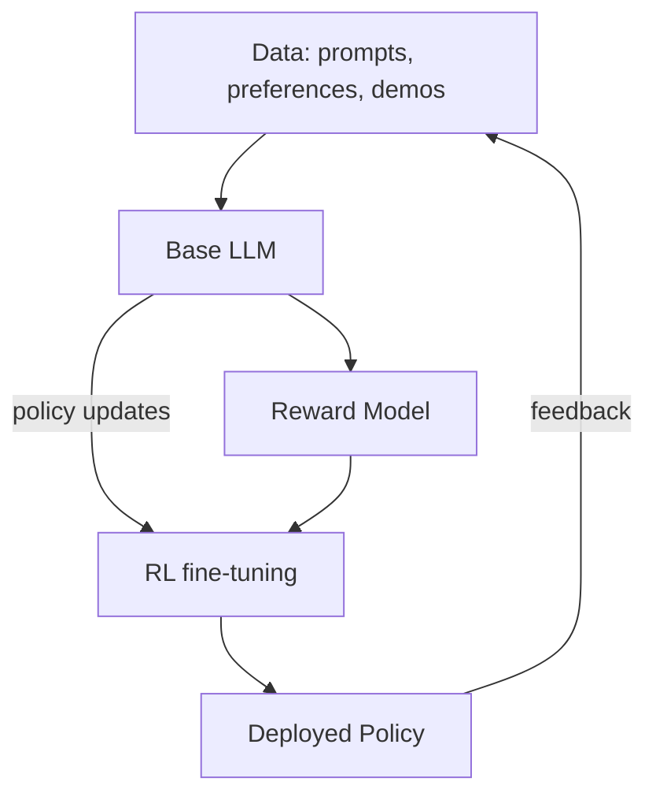
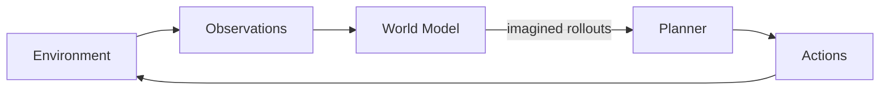
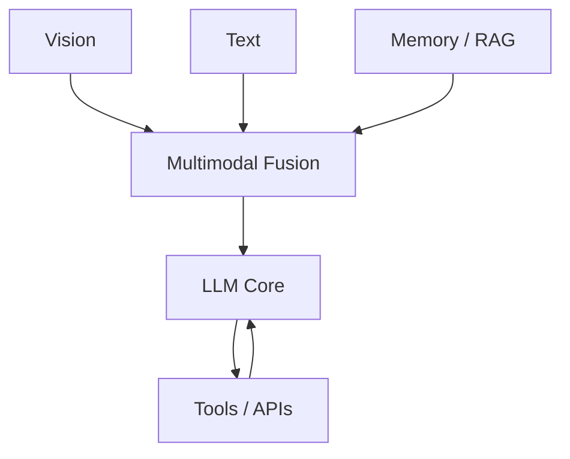

# reinforcement-learning


> Learning log and experiments around reinforcement learning for LLMs, world models, and multimodal agents.

<details>
<summary><strong>Quick navigation</strong></summary>

- [Repo map](#repo-map)
- [Focus areas](#focus-areas)
- [Learning path](#learning-path-suggested)
- [Visuals](#visuals)
- [Notes on structure](#notes-on-structure)
- [How to use this repo](#how-to-use-this-repo)
- [Reading notes](#reading-notes)
- [Curriculum](#curriculum)
- [Badge setup](#badge-setup)
</details>

## Repo map

```
reinforcement-learning/
├─ days/
│  ├─ Day01/  # RLFT/RFT on Azure AI Foundry
│  ├─ Day02/  # DPO + PPO (Azure DPO + PPO baseline)
│  └─ Day03/  # GRPO (RLVR/RFT)
├─ continual-learning/
├─ planning/
└─ README.md
```

## Focus areas

- RL for LLMs: preference optimization, policy gradients, reward modeling, and evaluation.
- Continual learning: update models over time without catastrophic forgetting.
- World models: latent dynamics, imagination-based planning, and environment modeling.
- Multimodal agents: vision-language grounding, tool use, memory, and retrieval.
- Alignment and safety: controllability, calibration, robustness, and interpretability.

## Learning path (suggested)

1. Fundamentals
   - RL basics: MDPs, policy/value functions, PPO, off-policy vs on-policy.
   - NLP basics: tokenization, transformers, attention, decoding strategies.
2. RL for LLMs
   - Reward modeling, preference datasets, KL-regularized objectives.
   - RLHF, RLAIF, DPO, PPO-style fine-tuning for LLMs.
3. World models
   - Latent state-space models, contrastive learning, predictive coding.
   - Model-based RL with planning in latent space.
4. Multimodal agents
   - Vision-language encoders, cross-attention fusion, tool-augmented agents.
   - Memory and retrieval (RAG) for grounding and long-horizon tasks.
5. Evaluation
   - Automatic evals, human evals, safety/robustness benchmarks.

## Visuals

### LLM + RL stack



### World model loop



### Multimodal agent anatomy



## Notes on structure

- `days/` holds day-by-day experiments, summaries, and lessons learned.
- `planning/` contains roadmaps, reading lists, and project scaffolds.

## How to use this repo

- Add daily notes under `days/DayXX/`.
- Track hypotheses, experiments, and results in each day folder.
- Keep longer-term goals and reading lists in `planning/`.

## Reading notes

- RLHF Book (MEAP v1): `planning/rlhf_book_notes.md`
- RLFT / RFT overview: `planning/rlft_concepts.md`
- RLFT / RFT long-form notes: `planning/rlft_longform_notes.md`

## References

- Kevin P. Murphy (Dec 3, 2025), *Reinforcement Learning: An Overview* (review): `https://arxiv.org/pdf/2412.05265`

## Curriculum

- Prompt (generate plan): `planning/learning_prompt.md`
- Goals (acceptance criteria): `planning/learning_goals.md`

## Badge setup

Replace `<OWNER>` in badge URLs with your GitHub username or org.
