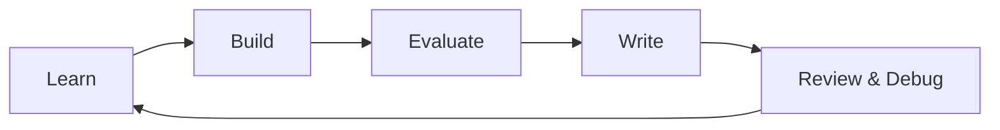

# RL-for-LLMs: Top-1% Learning Goals (120d)

This file is the contract: what must be true (artifacts + skills) for the 120-day plan to count.

<details>
<summary><strong>Quick navigation</strong></summary>

- [North Star](#1-north-star-what-top-1-means)
- [Portfolio deliverables](#2-portfolio-deliverables-public-quality)
- [Output cadence](#3-output-cadence-shipping-discipline)
- [Skill matrix](#4-skill-matrix-levels-0-5)
- [Weekly scoreboard](#5-weekly-scoreboard-copypaste)
- [Phase gates](#6-phase-gates-hard-exit-criteria)
- [Required diagnostics](#7-required-diagnostics-must-appear-repeatedly)
- [Capstone tests](#8-capstone-acceptance-tests)
</details>



## 1) North Star (what "top-1%" means)

By Day 120, I can do all of the following, on a new domain/use case with minimal ramp:

- Design an end-to-end RL-for-LLMs pipeline: logging -> dataset -> SFT baseline -> DPO/IPO/KTO/ORPO choice -> RFT/GRPO/PPO choice -> deployment plan.
- Debug unstable or "goodharted" runs from metrics alone (reward/KL/entropy/length/value loss): identify root cause, propose fixes, and validate with an ablation.
- Build an eval harness that catches real regressions (style drift, refusal drift, verbosity, hallucination incentives, reward hacking, safety regressions), not just one headline score.
- Translate RL decisions into business constraints: cost (tokens/$), latency, safety risk, failure blast radius, monitoring/rollback.

## 2) Portfolio deliverables (public-quality)

These are non-negotiable outputs. They should be publishable with minimal cleanup.

1. "RLHF/RFT on Azure" reference implementation (template)
   - Infra-as-code or reproducible setup notes.
   - Azure AI Foundry: DPO dataset workflow + RFT graders (string/model/python/multigrader).
   - Logging + monitoring dashboards or scripts.

2. One reproducible case study with ablations
   - A single use-case (choose one): customer support, credit desk, compliance QA, agentic tool-use.
   - Compare at least: SFT baseline vs DPO vs one RL/RFT run.
   - Include cost + quality trade-offs and at least 3 targeted ablations.

3. One short talk outline + slides
   - 10-15 minutes.
   - Contains one story: problem -> pipeline -> failure -> fix -> results -> lessons.

## 3) Output cadence (shipping discipline)

- Daily: 1 commit + a short writeup (200-600 words) + at least one concrete artifact.
- Weekly (every week, no exceptions):
  - 1 end-to-end build deliverable
  - 1 theory compression deliverable (math + intuition)
  - 1 evaluation/ablation deliverable
  - 1 blog post (or 2 short posts)

## 4) Skill matrix (levels 0-5)

Score yourself weekly. Evidence must be links to artifacts, not vibes.

| Skill | 0 | 1 | 2 | 3 | 4 | 5 |
| --- | --- | --- | --- | --- | --- | --- |
| Math | none | can read | can derive REINFORCE | can derive PPO/DPO + KL | can do constrained/Lagrangian | can reason about bias/variance trade-offs under distribution shift |
| Algorithms | none | runs scripts | implements one method | implements 2-3 + ablates | chooses methods by regime | invents/combines methods safely with diagnostics |
| Systems | none | local only | reproducible runs | cloud jobs + tracking | cost controls + monitoring | production-grade rollback/guardrails |
| Debugging | none | guesses | fixes obvious bugs | diagnoses from curves | designs targeted probes | anticipates failure modes + prevents them |
| Evaluation | none | one metric | basic harness | multi-axis eval suite | adversarial/red-team evals | evals predict real user/product outcomes |
| Research taste | none | copies | minor tweaks | good ablations | chooses high-leverage questions | consistently finds signal, avoids dead ends |

## 5) Weekly scoreboard (copy/paste)

```text
Week __ (Days __-__)
Build shipped: Y/N  (link)
Theory compression shipped: Y/N  (link)
Eval/ablation shipped: Y/N  (link)
Blog shipped: Y/N  (link)

Key metrics:
- Main task success: __
- Safety/refusal drift: __
- Hallucination proxy: __
- Avg output length: __
- KL (to reference): __
- Cost estimate ($ or tokens): __

Failures discovered (>=2):
- __
- __

Fixes validated (>=1):
- __

Skill scores (0-5): Math __ | Algorithms __ | Systems __ | Debugging __ | Evals __ | Taste __
```

## 6) Phase gates (hard exit criteria)

The 120-day plan must enforce phase exits. If exit criteria is not met, the plan must loop and fix.

- Phase 0 (Days 1-7): eval harness + logging skeleton exists; at least one baseline model run measured end-to-end.
- Phase 1 (Days 8-28): DPO pipeline works on Azure Foundry; dataset creation + eval report reproducible.
- Phase 2 (Days 29-56): RFT run with graders completes; stability diagnostics + KL controls demonstrated.
- Phase 3 (Days 57-84): multi-objective reward or constrained optimization implemented; demonstrated trade-off curves.
- Phase 4 (Days 85-120): capstone reference implementation + case study + talk shipped.

## 7) Required diagnostics (must appear repeatedly)

Every RL/DPO/RFT experiment is incomplete without these:

- Reward vs KL vs entropy vs length curves.
- Win-rate vs baseline (pairwise eval) + at least one automated metric.
- A failure-mode table: reward hacking, verbosity/length bias, refusal drift, safety regressions, mode collapse.
- Cost accounting: token counts, wall-clock, approximate $.

## 8) Capstone acceptance tests

- Another engineer can reproduce the main case study with documented steps.
- At least one "intentional failure" is demonstrated and fixed (e.g., length hacking or KL collapse).
- The eval harness flags a regression that a single metric would miss.
- Slides tell a coherent story with 1-2 charts and 3-5 concrete lessons.
